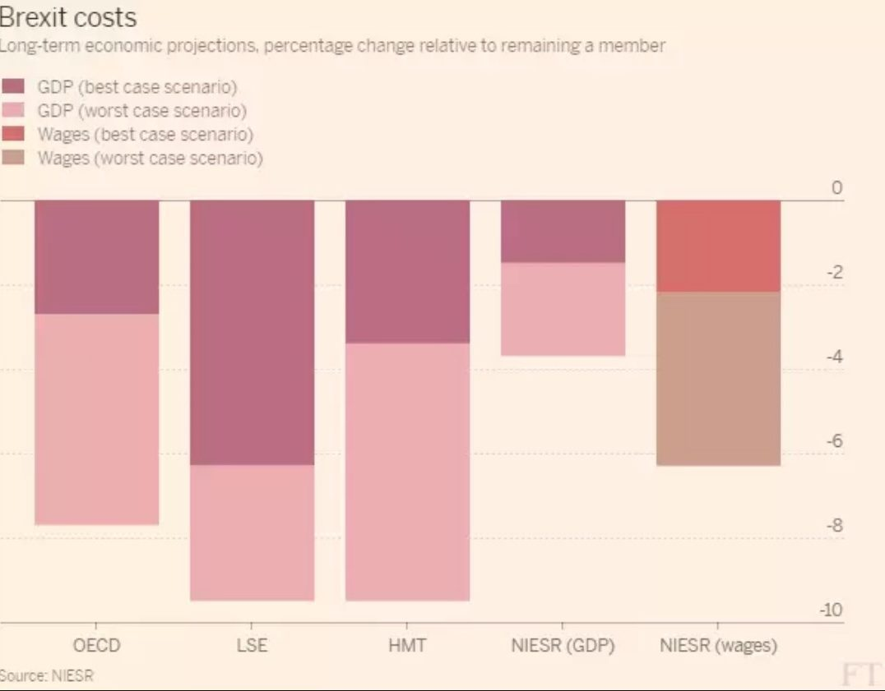
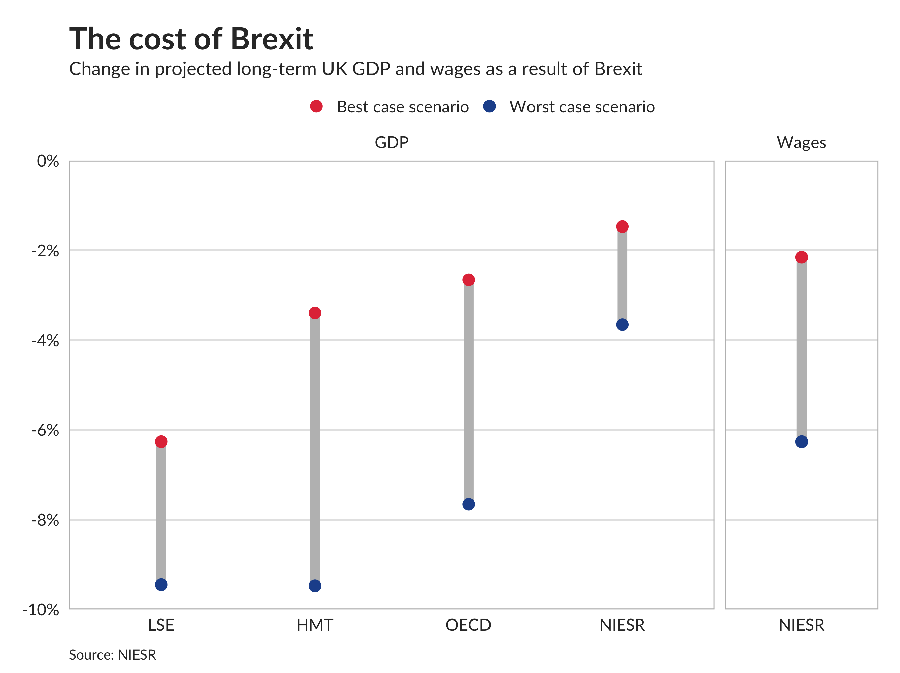

```{r setup, include=FALSE}
knitr::opts_chunk$set(echo = FALSE,
                      fig.retina = 2)
```

The Financial Times is home to some of the best data visualisation in the world today. They have a team of super talented graph wonks churning out all sorts of interesting charts in the kind of minimalist style I like. But occasionally I see FT graphs that could be improved with a few tweaks, like this one on Brexit from <a href="https://www.ft.com/content/39aec7e2-05a6-11e8-9650-9c0ad2d7c5b5">Martin Sandbu's excellent daily newsletter</a>:



This is a pretty good chart! But I think it could be improved by separating out wages from GDP, and by using dots instead of bars:



Separating out wages into its own little panel like this means that the legend can stay simple, with only two colours. The FT's original was good, but I think mine is a little clearer.
